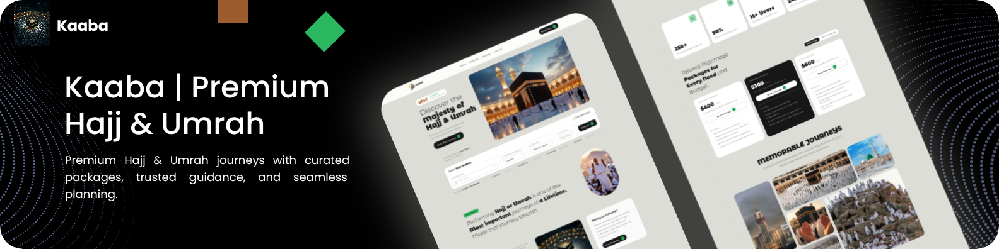
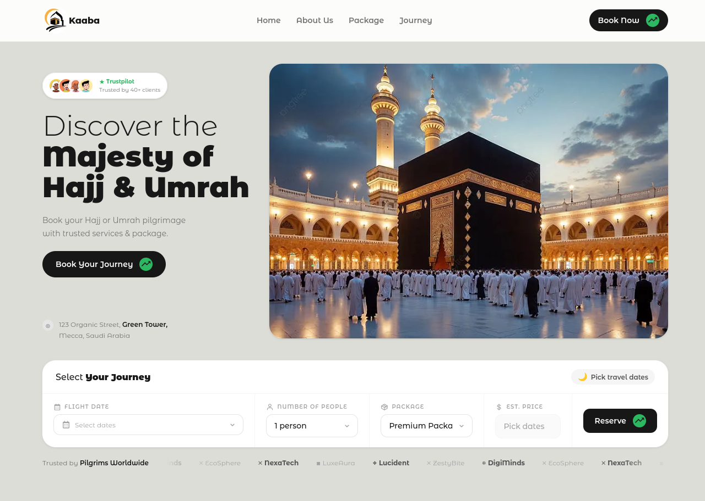

# 

  <div align="center">

**Premium Hajj & Umrah journeys with curated packages, trusted guidance, and seamless planning.**

A high-performance, responsive landing page that helps pilgrims discover and book their sacred journey with confidence.

[](https://nextjs.org)
[](https://www.typescriptlang.org)
[](https://tailwindcss.com)
[](https://react.dev)
[](https://www.framer.com/motion/)
[](./LICENSE)

  </div>

---

## ✨ Why Kaaba?

Planning a Hajj or Umrah trip is a deeply personal and complex endeavor. Kaaba provides a clean, focused experience that lets pilgrims:

- **Browse curated packages** — from Comfort to Elite, with transparent pricing
- **Compare travel options** at a glance with feature-rich cards
- **Book confidently** with a trusted, well-designed interface
- **Get inspired** through a rich gallery and community stats

Whether you're a first-time pilgrim or a returning visitor, Kaaba cuts through the noise and gets you to what matters.



## 🚀 Quick Start

```bash
pnpm install
pnpm run build
pnpm run dev
```

Open [http://localhost:3000](http://localhost:3000) to view the site.

---

## 🛠️ Tech Stack

| Layer         | Technology                                                                                          |
| ------------- | --------------------------------------------------------------------------------------------------- |
| Framework     | [![Next][Next.js]][Next-url]                                                                        |
| Language      | [![TypeScript][TypeScript]][TypeScript-url]                                                         |
| Styling       | [![Tailwind CSS][Tailwind]][Tailwind-url]                                                           |
| Animation     | [![Framer Motion][Framer]][Framer-url]                                                              |
| Date Handling | [![date-fns][Date-fns]][Date-fns-url] [![React Day Picker][React-Day-Picker]][React-Day-Picker-url] |
| Icons         | [![React Icons][React-Icons]][React-Icons-url]                                                      |
| Notifications | [![React Toastify][React-Toastify]][React-Toastify-url]                                             |

---

## 📦 Packages Offered

| Package     | Price                | Highlights                                                 |
| ----------- | -------------------- | ---------------------------------------------------------- |
| **Comfort** | $900–$1,800/person   | 3-star hotel, daily breakfast, guided tours                |
| **Premium** | $1,200–$2,400/person | 4-star hotel, breakfast & dinner, transfers                |
| **Elite**   | $2,000–$4,000/person | Business class, 5-star hotel, all meals, private transfers |

> Group discounts available: 40% off for 2+ persons on 4+ nights.

---

## 📂 Project Structure

```structure
components/       UI sections (Hero, About, Packages, Gallery, etc.)
├── utils/        Reusable atoms (Button, Logo, DateRangePicker, etc.)
data/             Static content (packages, partners)
lib/              Design system tokens
public/           Static assets (images, gallery, posters)
src/app/          Next.js App Router (layout, page, globals)
```

---

## 🏗️ Getting Started (Full Guide)

### Prerequisites

- Node.js ≥ 18
- [pnpm](https://pnpm.io) ≥ 9

### Installation

```bash
git clone https://github.com/yusuf-mahran/kaaba.git
cd kaaba
pnpm install
```

### Development

```bash
pnpm dev
```

### Production Build

```bash
pnpm build
pnpm start
```

### Lint

```bash
pnpm lint
```

---

## 📄 Key Files

- [`src/app/page.tsx`](src/app/page.tsx) — Main landing page composition
- [`src/app/layout.tsx`](src/app/layout.tsx) — Root layout, fonts & metadata
- [`src/app/globals.css`](src/app/globals.css) — Global styles
- [`data/packages.ts`](data/packages.ts) — Travel package definitions
- [`data/partners.ts`](data/partners.ts) — Trusted partner logos
- [`lib/design-system.ts`](lib/design-system.ts) — Design tokens

---

## 🤝 Contributing

Contributions, issues, and feature requests are welcome!

1. Fork the repository
2. Create your branch: `git checkout -b feat/your-feature`
3. Commit your changes: `git commit -m "feat: add your feature"`
4. Push to the branch: `git push origin feat/your-feature`
5. Open a Pull Request

Please use specific `git add <file>` commands rather than `git add .` to keep commits clean.

---

## 🛡️ Security

If you discover a security vulnerability, please open a [GitHub Issue](../../issues) or reach out privately. Do not disclose it publicly until it has been addressed.

---

## 📝 License

This project is licensed under the [MIT License](./LICENSE).

---

## 💬 Support

- Open an [Issue](../../issues) for bugs or feature requests
- Start a [Discussion](../../discussions) for questions and ideas

---

  <div align="center">
    Made with ❤️ for every pilgrim's sacred journey
  </div>

  <!-- MARKDOWN LINKS & IMAGES -->
  <!-- https://www.markdownguide.org/basic-syntax/#reference-style-links -->

[Next.js]: https://img.shields.io/badge/next.js-000000?style=for-the-badge&logo=nextdotjs&logoColor=white
[Next-url]: https://nextjs.org/
[TypeScript]: https://img.shields.io/badge/typescript-3178c6?style=for-the-badge&logo=typescript&logoColor=white
[TypeScript-url]: https://www.typescriptlang.org/
[Tailwind]: https://img.shields.io/badge/tailwindcss-38bdf8?style=for-the-badge&logo=tailwindcss&logoColor=white
[Tailwind-url]: https://tailwindcss.com/
[Framer]: https://img.shields.io/badge/Motion-000000?style=for-the-badge&logo=framer&logoColor=white
[Framer-url]: https://www.framer.com/motion/
[Date-fns]: https://img.shields.io/badge/date--fns-8C1B54?style=for-the-badge&logo=date-fns&logoColor=white
[Date-fns-url]: https://date-fns.org/
[React-Day-Picker]: https://img.shields.io/badge/react--day--picker-FF6347?style=for-the-badge&logo=react&logoColor=white
[React-Day-Picker-url]: https://react-day-picker.js.org/
[React-Icons]: https://img.shields.io/badge/react--icons-E91E63?style=for-the-badge&logo=react&logoColor=white
[React-Icons-url]: https://react-icons.github.io/react-icons/
[React-Toastify]: https://img.shields.io/badge/react--toastify-C047D8?style=for-the-badge&logo=react&logoColor=white
[React-Toastify-url]: https://fkhadra.github.io/react-toastify/
